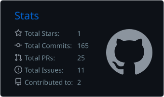
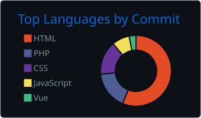

## Hi, I'm Oleksii Mizin (Lexx)

**Full-Stack TypeScript & AI Engineer** — I build web apps, APIs, and AI-powered products end to end.

🗓 8+ years commercial experience · 💬 English, async-friendly · 🧩 Architecture → backend → AI → deploy

---

### 🛠 What I work with

**Core — Full-Stack TypeScript** 
TypeScript · Node.js · NestJS · Express · Next.js

**AI & Automation** 
OpenAI & Claude APIs · Mastra · tool-calling · RAG · embeddings & vector search · n8n

**APIs & Data** 
REST · GraphQL · PostgreSQL · MySQL · MongoDB · Redis

**Frontend** 
React · Next.js · Vue.js · TailwindCSS · shadcn/ui

<!-- Optional badge row (renders as colored logo badges on GitHub). Delete for plain text. -->

---

### 🔭 Currently

- Building AI-powered products and agent workflows (OpenAI / Claude, Mastra, RAG)
- Designing scalable APIs and backend services in TypeScript (Node.js / NestJS)
- Automating internal workflows with n8n and custom backend services

---

### 📊 GitHub

